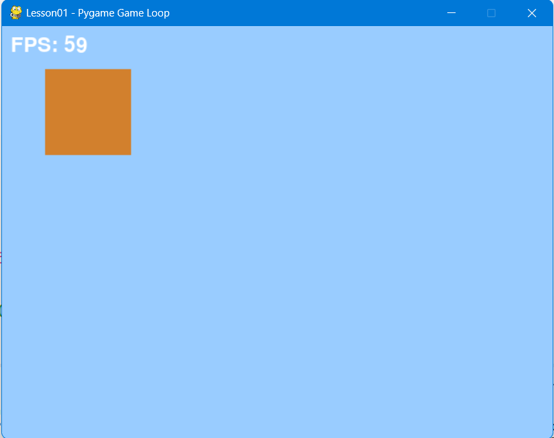

# Lesson01 - 最小游戏主循环实现（一切的起点）

## 学习目标

1. 掌握游戏主循环五部分：清屏 → 事件处理 → 逻辑更新 → 渲染绘制 → 屏幕刷新；
2. 理解双缓冲原理、画面残影成因、帧率控制；
3. 建立「循环驱动动态画面」的核心认知。

## 重点理解

- 主循环五步顺序不能颠倒，尤其清屏必须在绘制之前，否则产生残影。
- 双缓冲：`pygame.display.flip()` 交换前后台缓冲区，避免屏幕闪烁。
- 帧率控制：`pygame.time.Clock().tick(60)` 使循环每秒最多执行 60 次，稳定游戏速度。

## 动手练习题

1. 创建窗口 + 主循环 + FPS 显示 + 正常退出。
2. 循环内绘制固定方块，观察持续渲染。
3. 注释清屏代码，运行观察残影现象。
4. 注释帧率控制代码，对比观察程序的CPU占用率。

## 🔁 映射引擎原理

- 在 Godot 脚本中打印 `_process(delta)` 调用，思考引擎的主循环被隐藏在哪里。对比你手写的 `while running`。

## 效果图

