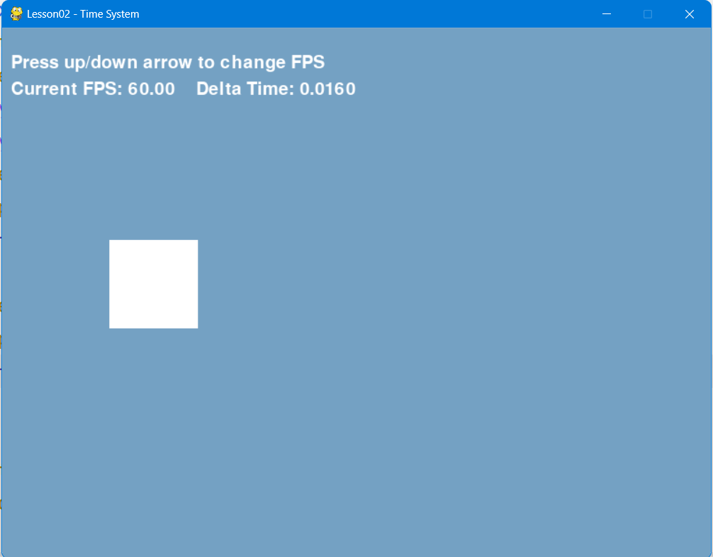
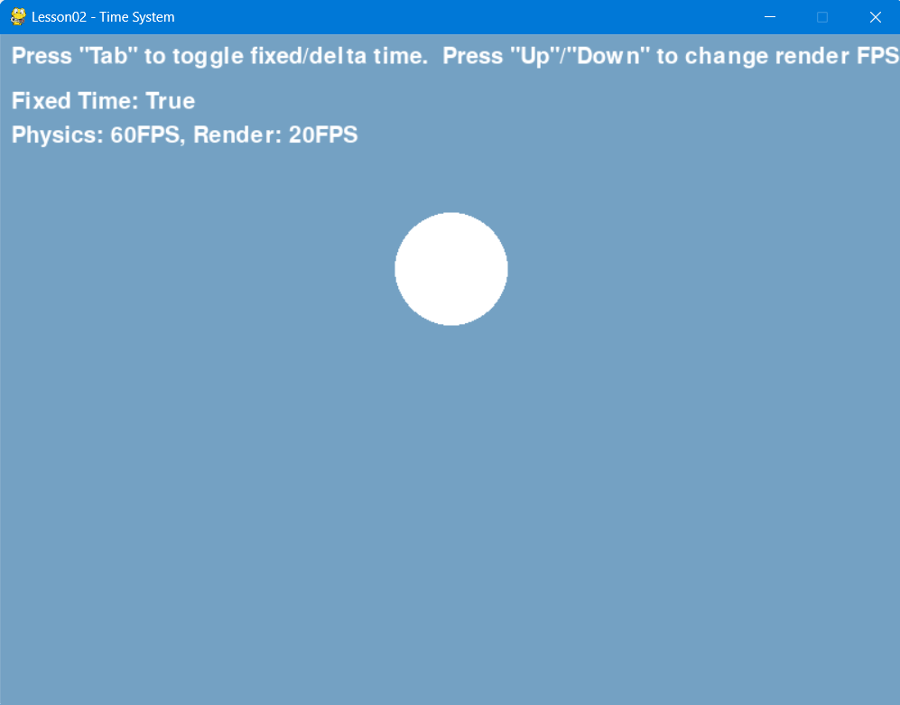

# Lesson02 - 时间系统与两种频率

## 学习目标

1. 理解游戏逻辑必须与帧率解耦的原因；
2. 实现基于 `delta` 的移动、动画、计时；
3. 掌握固定时间步长原理，区分逻辑更新与渲染。

## 重点理解

- 两种不同的“频率”
  - **逻辑更新频率（固定步长）**：用于物理、碰撞、刚体力学、AI 决策、游戏规则计算。以恒定间隔调用（如 1/60 秒），不受画面卡顿或渲染帧率影响。
  - **帧渲染频率（可变步长）**：用于绘制图形、纹理、UI、动画插值、屏幕输出。受显卡性能、垂直同步或人为帧率限制影响，每一帧的时间间隔可能变化。
- Delta Time（增量时间）
  - **定义**：上一帧结束到当前帧开始所经过的时间（秒）。
  - **公式**：`位移 = 速度 × delta`
  - **效果**：无论帧率是 30 还是 300，物体每秒移动的总距离保持恒定。
- Fixed Time 固定步长
  - **问题**：仅使用 delta 移动时，物理模拟（如跳跃高度、碰撞响应）仍可能因每帧时间差过大而不稳定。（著名的 “子弹穿透问题”）
  - **解决**：逻辑更新按固定时间间隔（如 1/60 秒）独立执行，渲染按实际帧率执行。
- 为什么物理模拟需要固定时间步长？`delta` 让匀速运动“走匀速”，但无法解决加速、碰撞、力带来的“变速率问题”。固定时间步长把时间切成均匀的小片，保证每片内物理世界行为一致且可控。

| 问题现象               | 仅用 `delta` 移动（可变步长）                            | 固定时间步长（如 1/60 秒）                                    |
| ------------------ | ---------------------------------------------- | --------------------------------------------------- |
| **快速物体穿过薄墙**（子弹穿透） | 帧率突降时，`dt` 变大，物体一帧内移动距离可能超过墙体厚度 → 直接穿过。        | 一帧内物理更新多次，每次只走一小步，距离 < 墙厚 → 可靠碰撞。                   |
| **跳跃高度波动**         | 帧率高时重力作用精细，跳得高；帧率低时第一帧重力就拉低大量速度 → 跳得低。按键手感不稳定。 | 每步重力增量固定（如 `vy += 9.8 * 1/60`），总上升量精确 → 每次跳跃高度完全一致。 |
| **弹性反弹轨迹**         | 大 `dt` 时可能反弹过头（能量误差累积），小球逐渐穿地或飞出去。             | 每步冲量计算精确，轨迹稳定可预测。                                   |
| **多物体堆叠/弹簧系统**     | 步长差异导致震荡不稳，容易“爆炸”或穿模。                          | 步长统一，系统行为与帧率无关。                                     |

- 引擎对照
  - Godot 中的 `_process(delta)` —— 可变步长，适合渲染相关更新（动画、UI、非关键逻辑）。
  - Godot 中的 `_physics_process(delta)` —— 固定步长（默认 60 次/秒），适合物理、移动、碰撞。

## 动手练习题

1. **方块移动** 实现一个方块以 10 像素/秒的速度向右移动。使用 `pygame.time.Clock()` 分别限制帧率为 30、60、100，观察每秒总位移是否基本一致。
2. **弹跳球模拟**。实现重力系统，边界反弹。分别用固定步长和直接用 delta 模拟弹跳球，对比帧率波动时弹跳高度是否稳定。
3. **技能冷却计时器** 实现一个简单的“技能”（例如按下空格键打印“Fire!”）。要求每次释放技能后必须等待 2 秒才能再次释放。
   - 方法 A：使用 `time.time()` 记录上次释放时间。
   - 方法 B：每帧累加 `delta` 维护一个冷却剩余时间变量。
   - 比较两种方法的优缺点。

## 🔁 映射引擎原理

在 Godot 中创建一个简单场景，分别编写：

- `_process(delta)` 中打印 "process" 并移动一个角色
- `_physics_process(delta)` 中打印 "physics\_process" 并移动另一个角色

观察控制台输出频率。思考并回答：

> **为什么跳跃、碰撞检测等物理相关代码必须放在** **`_physics_process`** **中？**

（提示：如果放在 `_process` 里，帧率越高，每秒钟施加的作用力次数越多，会导致跳跃高度不固定。）

## 补充思考（可选）

- 如果一个游戏帧率突然掉到 10 FPS，用 delta 移动的子弹和用固定时间步长移动的子弹，哪个更容易穿过薄墙？为什么？
- 查阅资料了解 Pygame 的 `pygame.time.get_ticks()` 与 `time.time()` 在计时上的区别（毫秒级精度 vs 秒级浮点）。

## 效果图

《方块移动》

《弹跳球模拟》

